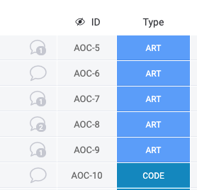

# serverless-monday

This tool can be used as a WebHook for Monday.com to assign Auto Incremented IDs to pulses.
Uses Node.js and designed to be deployed on AWS Lambda.
Has a few additional APIs for manual usage.



## Usage

* Create a text column with 'ID' title in your board
* Create Firebase App
* Attach you Firebase Admin credentials as serviceAccountKey.json file
* Setup .env file with:

```text
STAGE=
DEFAULT_PREFIX=
DB_URL=
MONDAY_TOKEN=
```

where
- STAGE ('dev', 'prod' etc) used to mark a deployment type
- DEFAULT_PREFIX could be anything. Usually it is an abbreviation of your project e.g. BAC, AOC etc.
  So the resulting number will be like BAC-45, AOC-14.
- DB_URL - is the url to your Firestore db  (https://[your_account].firebasedatabase.app)
- MONDAY_TOKEN - is your token for Monday API

### Install and setup Serverless for Node.js and AWS Lambda

* npm install -g serverless
* sls config credentials --provider aws --key xxx --secret xxx
* npm install --save express serverless-http
* npm install --save express multer 
* npm install serverless-dotenv-plugin --save
* npm install serverless-offline --save
* npm install firebase-admin --save

Deploy using:
* sls deploy

Debug locally using:
* sls offline start

### Monday.com

Install WebHook using https://support.monday.com/hc/en-us/articles/360003540679-Webhook-Integration-
as [your_lambda_url]/monday/newPulse to a new pulse creation event on the board

Additionally:

Call POST [your_lambda_url]/monday/assignAllBoardIds (with boardId string param) to assign ids to all pulses in the specified board